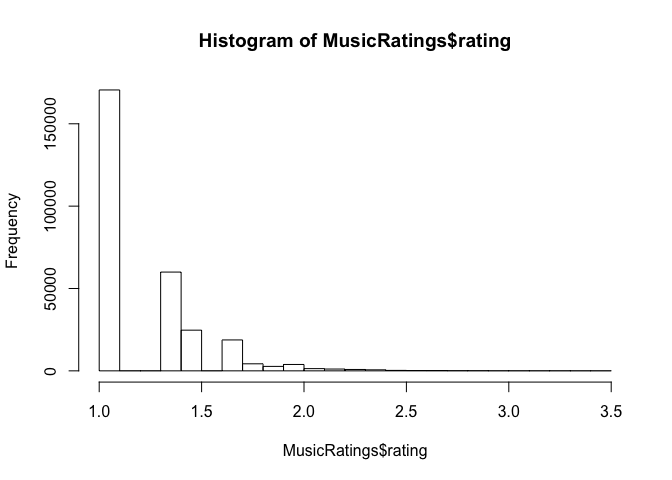
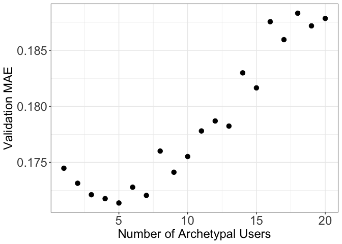

    library(softImpute)
    library(ggplot2)
    library(tidyverse)
    library(MASS)
    library(rpart)

Content
=======

-   1.  Data Preprocessing

-   1.  Simple Additive Method

-   1.  Collaborative Filtering method

-   1.  Blending Models with Extra Features

<!-- -->

    Songs <- read.csv("Songs.csv", sep = ",")
    MusicRatings <- read.csv("MusicRatings.csv", sep = ",")
    Users <- read.csv("Users.csv", sep = ",")

Load the data and calculate some summary statistics

    hist(MusicRatings$rating)

    paste("Total Songs:", nrow(unique(MusicRatings["songID"])))

    ## [1] "Total Songs: 807"

    paste("Total users:", nrow(unique(Users)))

    ## [1] "Total users: 2421"

    paste("Range of ratings: (" ,min(MusicRatings["rating"]),",",max(MusicRatings["rating"]),")")

    ## [1] "Range of ratings: ( 1 , 3.43296929087441 )"

1. Data Preprocessing
---------------------

### Train Test Split

#### a) Training set with 84% of the observations. 

#### b) Validation set A to be used for tuning the collaborative filtering model, with 4% of the observations. 

#### c) Validation set B to be used for blending, with 4% of the observations.

#### d) Testing set with 8% of the observations

    set.seed(345)
    train.ids <- sample(nrow(MusicRatings), 0.92*nrow(MusicRatings))
    train <- MusicRatings[train.ids,]
    test <- MusicRatings[-train.ids,]

    ## split out the validation part
    val.ids <- sample(nrow(train), (8/92)*nrow(train))
    val <- train[val.ids,]

    ## update train set
    train <- train[-val.ids,]

    ## get valA and val B
    valA.ids <- sample(nrow(val), 0.5*nrow(val))
    valA <- val[valA.ids,]
    valB <- val[-valA.ids,]

#### e) construct an incomplet training set ratings matrix.

    mat.train <- Incomplete(train$userID, train$songID, train$rating)

    paste("Dimension of the matrix", dim(mat.train)[1], "*", dim(mat.train)[2])

    ## [1] "Dimension of the matrix 2421 * 807"

2. Simple Additiive Method
--------------------------

Let *X* denote the “complete” ratings matrix, i.e.,
*X**i*, *j* denotes either the observed rating if user i
actually rated song j or the “hypothetical” such rating if user i has
not yet rated song j. We are interested in predicting the values of
*X**i*, *j* that are not observed. Let us first consider the
following model:  

*X**i*, *j* = *α**i* + *β**j* + *ϵ**i*, *j*
(1)

 

where *α**i* is a coefficient that depends only on the
particular row i (i.e., user), "j is a coefficient that depends only on
the particular column j (i.e., song), and *ϵ**i*, *j* is a
noise term.

#### i) Parameters

There are two types of parameters in this model *α* and *β*; A total of
2421 *α* and 807 *β*. So there are 3228 parameters to fit.  
There’re 243104 observations in the training set, so we’ll train the
model with 243104 observations and fill in the rest of the matrix.

#### ii) Cost function

The function biScale in the softImpute package fits a model of the form
(1) using a leastsquares approach. That is, it solves the following
optimization problem:  

*m**i**n*∑(*i*, *j*) ∈ *o**b**s*(*X**i*, *j* − *β**j* − *α**i*)2
 

obs denotes the set of observed entries in the training set(here we set
*X**i*, *j* ← *o**b**s**i*, *j* as all
observations that are observed).  

    ## standardized the matrix by biScale function
    biscale_matrix <- biScale(mat.train, maxit = 1000, row.scale = FALSE, col.scale = FALSE)

    # Aggregate over the column, neglecting all the NAs, a.k.a find the average over column to find the beta hat for each song
    no.userbias <- attr(biscale_matrix,'biScale:column')[[1]]

    # Aggregate over the row, neglecting all the NAs, a.k.a find the average over row to find the alpha hat for each song
    no.songbias <- attr(biscale_matrix,'biScale:row')[[1]]

    #append user alpha_hat to user
    Users$alpha <- no.songbias
    #append song beta_hat to song
    Songs$beta <- no.userbias

    ## top 3 songs
    head(Songs[order(-Songs$beta), ], 3)

    ##     songID       songName year        artist   genre     beta
    ## 54      54 You're The One 1990 Dwight Yoakam Country 1.710709
    ## 26      26           Undo 2001         Bjork    Rock 1.695093
    ## 439    439        Secrets 2009   OneRepublic    Rock 1.646022

    ## top 3 users give highest rating
    head(Users[order(-Users$alpha), ], 3)

    ##      userID     alpha
    ## 1540   1540 0.5950190
    ## 838     838 0.5089926
    ## 1569   1569 0.4947081

    ## merge the user alpha_hat information into test.mod1
    test.mod1 <- merge(Users,test)
    ## merge the song beta_hat information into test.mod1
    test.mod1 <- merge(dplyr::select(Songs,'songID','beta'),test.mod1)

    #add up alpha and beta to get x
    test.mod1$x <- test.mod1$alpha + test.mod1$beta 

    head(test.mod1,3)

    ##   songID     beta userID       alpha rating         x
    ## 1      1 1.062561    292  0.05811128      1 1.1206727
    ## 2      1 1.062561   1911 -0.10743325      1 0.9551282
    ## 3      1 1.062561   1436  0.15387844      1 1.2164399

#### calculate the metrics of the “Simple Additive” method

    scale = max(MusicRatings["rating"]) - min(MusicRatings["rating"])

    ## normalized MAE and RMSE
    MAE <- mean(abs(test.mod1$x - test.mod1$rating))/scale
    MSE <- mean((test.mod1$x - test.mod1$rating)^2)
    RMSE <- sqrt(MSE)/scale

    #out-of-sample performace of biscale model
    OSR2 <- function(predictions, testActual) {
      SSE <- sum((testActual - predictions)^2)
      SST <- sum((testActual - mean(testActual))^2)
      r2 <- 1 - SSE/SST
      return(r2)
    }

    OSR2_Si = OSR2(test.mod1$x, test.mod1$rating)

    paste("Normalized Model 1 MAE: ",MAE)

    ## [1] "Normalized Model 1 MAE:  0.0748454682603173"

    paste("Normalized Model 1 RMSE: ",RMSE)

    ## [1] "Normalized Model 1 RMSE:  0.0979105637628372"

    paste("OSR2: ",OSR2_Si)

    ## [1] "OSR2:  0.279929963534057"

3. Collaborative Filtering method
---------------------------------

Now let’s consider the following model:  

*X**i*, *j* = *Z**i*, *j* + *α**i* + *β**j* + *ϵ**i*, *j*
(2)  

which is the same as part (2) except for an additional term
*Z**i*, *j*. Here, Z represents the low-rank collaborative
filtering model, i.e., we presume that Z is a matrix with rank at most
k. Equivalently, the number of archetypes is at most k.  

Therefore, there’re 4 types of parameters in total.   The first two
types are the same as previous, 2421 users and 807 songs, now plus the
latent variables in dimension k, so there are another 2421k + 807k
parameters more.    

We will fit the model (2) by using the previously computed estimates of
*α* and *β* from part (2). That is, letting *α̂* and *β̂* denote these
estimates, we will use the softImpute function to fit a collaborative
filtering model on the incomplete training set matrix of residuals
$X\_{i,j}^{C} = X\_{i,j} − \\hat{\\alpha\_{i}} − \\hat{\\beta\_{j}}$.
   Thankfully, this object has already been returned to us by
the biScale function in part (2).   Next, We’ll use the previously
constructed validation set A to determine the value of k, i.e., the
number of archetypes that should be selected.

    mae.vals = rep(NA, 20)

    ## we'll test k ranging from 1 to 20
    for (rnk in seq_len(20)) {
      #print(str_c("Trying rank.max = ", rnk))
      mod <- softImpute(biscale_matrix, rank.max = rnk, lambda = 0, maxit = 1000)
      preds <- impute(mod, valA$userID, valA$songID) %>% pmin(5) %>% pmax(1) # clip rating from 1 to 5
      mae.vals[rnk] <- mean(abs(preds - valA$rating))
    }

    mae.val.df <- data.frame(rnk = seq_len(20), mae = mae.vals)
    ggplot(mae.val.df, aes(x = rnk, y = mae)) + geom_point(size = 3) + 
      ylab("Validation MAE") + xlab("Number of Archetypal Users") + 
      theme_bw() + theme(axis.title=element_text(size=18), axis.text=element_text(size=18))

    bestRank = which.min(mae.vals)

    mod.final <- softImpute(mat.train, rank.max = bestRank, lambda = 0, maxit = 1000)
    preds <- impute(mod.final, test$userID, test$songID) %>% pmin(5) %>% pmax(1)

    MAE_Co <- mean(abs(preds - test$rating))/scale
    RMSE_Co <- sqrt(mean((preds - test$rating)^2))/scale
    OSR2_Co <- OSR2(preds, test$rating)

    paste("Best # of latent variable:", bestRank)

    ## [1] "Best # of latent variable: 5"

    paste("Normalized Model 2 MAE: ",MAE_Co)

    ## [1] "Normalized Model 2 MAE:  0.0695933261709417"

    paste("Normalized Model 2 RMSE: ",RMSE_Co)

    ## [1] "Normalized Model 2 RMSE:  0.0949049115737837"

    paste("Model 2 OSR2: ", OSR2_Co)

    ## [1] "Model 2 OSR2:  0.323460723323549"

4. Blending Models with Extra Features
--------------------------------------

We’ll add some additional features associated with the songs in this
section. 

First, with the following independent variables: (i) genre of the song,
(ii) year that the song was released, apply Linear Regression & CART to
predict the rating seperately.  Both (i) and (ii) are treated as
factors/categorical variables and we’ll use the train set data for
training like before.

    # preprocess the data
    train.d = merge(train, Songs)
    train.d$genre = as.factor(train.d$genre)
    train.d$year = as.factor(train.d$year)

    test.d = merge(test, Songs)
    test.d$genre = as.factor(test.d$genre)
    test.d$year = as.factor(test.d$year)

fit the linear regression

    lm_model <- lm(data = train.d, rating~ year + genre)
    summary(lm_model)

    ## 
    ## Call:
    ## lm(formula = rating ~ year + genre, data = train.d)
    ## 
    ## Residuals:
    ##     Min      1Q  Median      3Q     Max 
    ## -0.6317 -0.1937 -0.1695  0.1291  2.1493 
    ## 
    ## Coefficients:
    ##                  Estimate Std. Error t value Pr(>|t|)    
    ## (Intercept)      1.675338   0.014798 113.215  < 2e-16 ***
    ## year1976        -0.306159   0.016956 -18.056  < 2e-16 ***
    ## year1978        -0.488420   0.025067 -19.485  < 2e-16 ***
    ## year1979        -0.110935   0.019914  -5.571 2.54e-08 ***
    ## year1985        -0.347731   0.026126 -13.310  < 2e-16 ***
    ## year1986        -0.265667   0.016496 -16.105  < 2e-16 ***
    ## year1987        -0.341809   0.017032 -20.068  < 2e-16 ***
    ## year1988        -0.229356   0.016101 -14.245  < 2e-16 ***
    ## year1990        -0.043651   0.016404  -2.661  0.00779 ** 
    ## year1991        -0.404182   0.015496 -26.083  < 2e-16 ***
    ## year1992        -0.317576   0.014950 -21.242  < 2e-16 ***
    ## year1993        -0.341099   0.014906 -22.883  < 2e-16 ***
    ## year1995        -0.296915   0.016039 -18.512  < 2e-16 ***
    ## year1996        -0.502113   0.013946 -36.005  < 2e-16 ***
    ## year1997        -0.343774   0.014568 -23.597  < 2e-16 ***
    ## year1998        -0.502885   0.016465 -30.543  < 2e-16 ***
    ## year1999        -0.347217   0.013818 -25.128  < 2e-16 ***
    ## year2000        -0.385580   0.013446 -28.677  < 2e-16 ***
    ## year2001        -0.343779   0.013555 -25.362  < 2e-16 ***
    ## year2002        -0.372743   0.013398 -27.820  < 2e-16 ***
    ## year2003        -0.398424   0.013275 -30.012  < 2e-16 ***
    ## year2004        -0.447022   0.013541 -33.012  < 2e-16 ***
    ## year2005        -0.400869   0.013296 -30.149  < 2e-16 ***
    ## year2006        -0.399309   0.013257 -30.121  < 2e-16 ***
    ## year2007        -0.400590   0.013267 -30.194  < 2e-16 ***
    ## year2008        -0.403350   0.013244 -30.454  < 2e-16 ***
    ## year2009        -0.362461   0.013254 -27.348  < 2e-16 ***
    ## year2010        -0.408731   0.013469 -30.346  < 2e-16 ***
    ## genreElectronic -0.045932   0.007020  -6.543 6.03e-11 ***
    ## genreFolk       -0.058758   0.007602  -7.730 1.08e-14 ***
    ## genrePop        -0.081063   0.006902 -11.745  < 2e-16 ***
    ## genreRap        -0.067647   0.007464  -9.063  < 2e-16 ***
    ## genreRnB        -0.167922   0.007203 -23.312  < 2e-16 ***
    ## genreRock       -0.102500   0.006807 -15.058  < 2e-16 ***
    ## ---
    ## Signif. codes:  0 '***' 0.001 '**' 0.01 '*' 0.05 '.' 0.1 ' ' 1
    ## 
    ## Residual standard error: 0.2754 on 243070 degrees of freedom
    ## Multiple R-squared:  0.03391,    Adjusted R-squared:  0.03378 
    ## F-statistic: 258.5 on 33 and 243070 DF,  p-value: < 2.2e-16

    ## get the testset performance of linear regression
    test.mod1$lm_pred = predict(lm_model, test.d)

    MAE_lm <- mean(abs(test.mod1$lm_pred - test.mod1$rating))/scale
    RMSE_lm <- sqrt(mean((test.mod1$lm_pred - test.mod1$rating)^2))/scale
    OSR2_lm <- OSR2(test.mod1$lm_pred, test.mod1$rating)

    paste("Linear Regression MAE: ",MAE_lm)

    ## [1] "Linear Regression MAE:  0.0929297649399207"

    paste("Linear Regression RMSE: ",RMSE_lm)

    ## [1] "Linear Regression RMSE:  0.113580449020475"

    paste("Linear Regression OSR2: ", OSR2_lm)

    ## [1] "Linear Regression OSR2:  0.0310021810379405"

fit the CART

    CART <- rpart(rating ~ year + genre, 
                  data= train.d, method="anova") 

    test.mod1$cart_pred <- predict(CART, test.d)

    MAE_cart <- mean(abs(test.mod1$cart_pred - test$rating))/scale
    RMSE_cart <- sqrt(mean((test.mod1$cart_pred - test$rating)^2))/scale
    OSR2_cart <- OSR2(test.mod1$cart_pred, test.mod1$rating)

    paste("Linear Regression MAE: ",MAE_cart)

    ## [1] "Linear Regression MAE:  0.0954948888549972"

    paste("Linear Regression RMSE: ",RMSE_cart)

    ## [1] "Linear Regression RMSE:  0.116027045314915"

    paste("Linear Regression OSR2: ", OSR2_cart)

    ## [1] "Linear Regression OSR2:  0.00982380401764182"

Now, use validation set B to perform blending of the collaborative
filtering model (2) trained in part (3) and the two models
trained(linear regression & CART) above.

    ### construct valB.blend with prediction all other models
    valB.blend = merge(Songs, valB)
    valB.blend = merge(Users, valB.blend)
    valB.blend$cf_pred = impute(mod.final, valB.blend$userID, valB.blend$songID) %>% pmin(5) %>% pmax(1)
    valB.blend$genre = as.factor(valB.blend$genre)
    valB.blend$year = as.factor(valB.blend$year)
    valB.blend$lm_pred = predict(lm_model, valB.blend)
    valB.blend$cart_pred= predict(CART, valB.blend)
    valB.blend$simp_pred = valB.blend$alpha + valB.blend$beta

Fitted the blend model

    ## get the blend model
    lm_blend = lm(data = valB.blend, rating ~ cf_pred + lm_pred + simp_pred + cart_pred)
    summary(lm_blend)

    ## 
    ## Call:
    ## lm(formula = rating ~ cf_pred + lm_pred + simp_pred + cart_pred, 
    ##     data = valB.blend)
    ## 
    ## Residuals:
    ##      Min       1Q   Median       3Q      Max 
    ## -1.10438 -0.14088 -0.04321  0.13410  1.35007 
    ## 
    ## Coefficients:
    ##              Estimate Std. Error t value Pr(>|t|)    
    ## (Intercept)  0.016290   0.075292   0.216    0.829    
    ## cf_pred      0.660720   0.021141  31.252   <2e-16 ***
    ## lm_pred     -0.012093   0.054273  -0.223    0.824    
    ## simp_pred    0.326133   0.025697  12.692   <2e-16 ***
    ## cart_pred    0.009138   0.081619   0.112    0.911    
    ## ---
    ## Signif. codes:  0 '***' 0.001 '**' 0.01 '*' 0.05 '.' 0.1 ' ' 1
    ## 
    ## Residual standard error: 0.2266 on 11571 degrees of freedom
    ## Multiple R-squared:  0.3506, Adjusted R-squared:  0.3504 
    ## F-statistic:  1562 on 4 and 11571 DF,  p-value: < 2.2e-16

    ### construct test.blend with prediction all other models
    test.blend = merge(Songs, test)
    test.blend = merge(Users, test.blend)
    test.blend$cf_pred = impute(mod.final, test.blend$userID, test.blend$songID) %>% pmin(5) %>% pmax(1)
    test.blend$genre = as.factor(test.blend$genre)
    test.blend$year = as.factor(test.blend$year)
    test.blend$lm_pred = predict(lm_model, test.blend)
    test.blend$cart_pred= predict(CART, test.blend)
    test.blend$simp_pred = test.blend$alpha + test.blend$beta
    ## store the test predictions
    test.blend$blend_pred = predict(lm_blend, test.blend)

    MAE_blend <- mean(abs(test.blend$blend_pred - test.blend$rating))/scale
    RMSE_blend <- sqrt(mean((test.blend$blend_pred - test.blend$rating)^2))/scale
    OSR2_blend <- OSR2(test.blend$blend_pred, test.blend$rating)

    paste("Linear Regression MAE: ",MAE_blend)

    ## [1] "Linear Regression MAE:  0.0706025400222673"

    paste("Linear Regression RMSE: ",RMSE_blend)

    ## [1] "Linear Regression RMSE:  0.0939475625361027"

    paste("Linear Regression OSR2: ", OSR2_blend)

    ## [1] "Linear Regression OSR2:  0.337041000087101"

Summary
-------

    data.frame("Model" = c("Simple Additive Model", "Collaborative Filtering", "Linear Regression", "CART", "Blended"), "MAE" = c(MAE, MAE_Co, MAE_lm, MAE_cart, MAE_blend), "RMSE" = c(RMSE,RMSE_Co,RMSE_lm,RMSE_cart,RMSE_blend), "OSR^2" = c(OSR2_Si,OSR2_Co,OSR2_lm,OSR2_cart,OSR2_blend))

    ##                     Model        MAE       RMSE       OSR.2
    ## 1   Simple Additive Model 0.07484547 0.09791056 0.279929964
    ## 2 Collaborative Filtering 0.06959333 0.09490491 0.323460723
    ## 3       Linear Regression 0.09292976 0.11358045 0.031002181
    ## 4                    CART 0.09549489 0.11602705 0.009823804
    ## 5                 Blended 0.07060254 0.09394756 0.337041000
